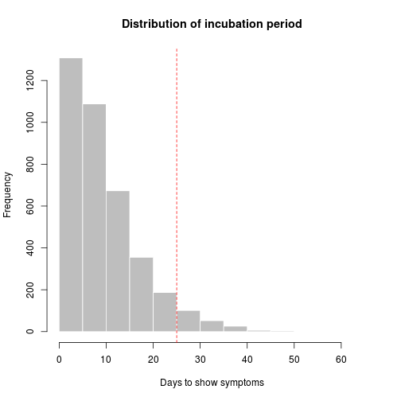
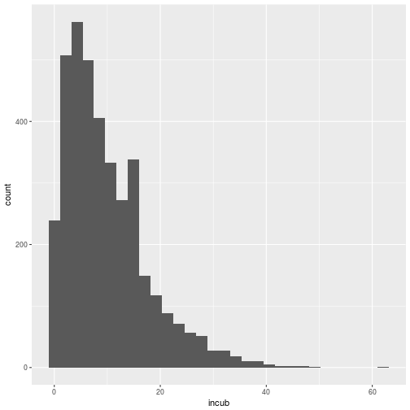

# Estimating the incubation period of a simulated Ebola outbreak


#### Incubation period

In the following, we use a simulated Ebola outbreak linelist to illustrate how to estimate the empirical distribution of the incubation time (delay between exposure and symptom onset).


We first load the data:


```r
library(outbreaks)
library(ggplot2)
dat <- ebola.sim$linelist
```

We compute the incubation period and ensure that the result is `numeric`:

```r
incub <- dat$date.of.onset - dat$date.of.infection
head(incub)
```

```
## Time differences in days
## [1] NA  6  3 NA  4 37
```

```r
length(incub)
```

```
## [1] 5888
```

```r
summary(incub)
```

```
##   Length    Class     Mode 
##     5888 difftime  numeric
```

```r
incub <- as.numeric(incub)
summary(incub)
```

```
##    Min. 1st Qu.  Median    Mean 3rd Qu.    Max.    NA's 
##   0.000   4.000   8.000   9.921  14.000  62.000    2087
```

We remove the missing values, compute the mean and variance:

```r
sum(is.na(incub))
```

```
## [1] 2087
```

```r
incub <- incub[!is.na(incub)]
mean(incub)
```

```
## [1] 9.921336
```

```r
var(incub)
```

```
## [1] 59.89197
```

Get the 95 percentile:

```r
t <- quantile(incub, .95)
t
```

```
## 95% 
##  25
```

Quarantine should last for at least **25 days**.

Plot using basic graphics:

```r
hist(incub, col="grey", border="white", xlab = "Days to show symptoms", main = "Distribution of incubation period")
abline(v = t, col = "red", lty = 2)
```



Version using *ggplot2*:


```r
ggplot(data.frame(incubation = incub), aes(x=incub)) + 
  geom_histogram() +
  labs("Days to show symptoms", main = "Distribution of incubation period")
```

```
## `stat_bin()` using `bins = 30`. Pick better value with `binwidth`.
```




<br>

# Compiling this document yourself

## What is this?

This document is generated by compiling a rmarkdown (`.Rmd`) document, i.e. a combination of Markdown and R (!). We recommend using using [*knitr*](http://yihui.name/knitr/) to compile it (see instructions below for downloading the source and compiling it).

The following links can be useful for more information on:

- a [*markdown*](http://github.com/adam-p/markdown-here/wiki/Markdown-Cheatsheet) cheat sheet

- [*knitr*](http://yihui.name/knitr/), a nice package for literate programming using R

- [*rmarkdown*](http://rmarkdown.rstudio.com/), a package extending *knitr*'s features for rmarkdown; amongst others, useful to convert `Rmd` to `pdf`.


## Download, compile, use as template
To compile this document, you first need to download a handful of files:

```r
## file URL
url <- "https://raw.githubusercontent.com/reconhub/rmd-example/master/README.Rmd"

## download file
download.file(url, "incubation.Rmd", method = "curl")
```

And then compile the document using:

```r
knitr::knit2html("incubation.Rmd")
```

To use this document as a template, simply rename it and replace its content with your own data analysis. Note that many more templates are available on [*knitr*'s website](http://yihui.name/knitr/).


<br>

# Credits

Author: [Thibaut Jombart](https://sites.google.com/site/thibautjombart/)

Licence: this work is released under [Creative Common Attribution 4.0](http://creativecommons.org/licenses/by/4.0/).

<a rel="license" href="http://creativecommons.org/licenses/by/4.0/"></a>


